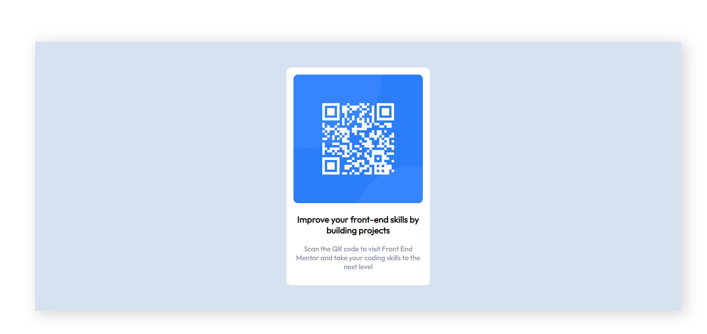

# Frontend Mentor - QR code component solution

## Overview

### Screenshot

### Links
- Live Site URL: https://qrcodechallenge1.netlify.app/

## My process

### Built with
- CSS custom properties
- Flexbox
- [React](https://reactjs.org/) - JS library

### What I learned

I learned more about mediaqueries and making my components more beautiful with border-radius.

### Continued development

I'll be focusing on the grid system and flexbox most likely.

## Author

- Website - [Portfolio](https://www.elyessaddem.me)
- Frontend Mentor - [@Elyes3](https://www.frontendmentor.io/profile/Elyes3)

